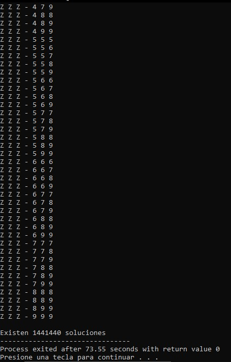

# License Plate Combination Generator

A console-based application that generates ordered alphanumeric license plate combinations using a brute-force algorithm and doubly linked lists.

## Overview

This project implements a brute-force algorithm to generate license plate combinations following the format:

AAA-000

The algorithm systematically evaluates every possible combination while applying ordering constraints to both letters and digits to reduce duplicate permutations.

Each valid combination is dynamically stored in a doubly linked list and later traversed to display all generated results along with the total number of valid combinations.

## Features

- Brute-force generation of alphanumeric combinations.
- Ordered letter combinations.
- Ordered numeric combinations.
- Dynamic storage using doubly linked lists.
- Sequential traversal of generated combinations.
- Total combination count.
- Console-based interface.

## Screenshot



## Technologies

- C
- Standard C Library
- Dev-C++

## Project Structure

```text
.
├── assets
│   └── images
│       └── license_plate_combination_generator_demo.jpg
├── license_plate_combination_generator.cpp
├── README.md
├── LICENSE
└── .gitignore
```

## How to Compile

Using GCC:

```bash
g++ license_plate_combination_generator.cpp -o license_plate_combination_generator
```

## How to Run

Windows

```bash
license_plate_combination_generator.exe
```

Linux/macOS

```bash
./license_plate_combination_generator
```

## Concepts Demonstrated

- Brute-force algorithms
- Combinatorial generation
- Doubly linked lists
- Dynamic memory allocation
- Nested loops
- Character manipulation
- Sequential traversal of linked structures

## Future Improvements

- Allow custom license plate formats.
- Export generated combinations to TXT or CSV files.
- Add search and filtering capabilities.
- Improve memory management by releasing allocated nodes.
- Optimize the generation algorithm to reduce execution time.

## License

This project is licensed under the MIT License.

## Author

Luis Alva
